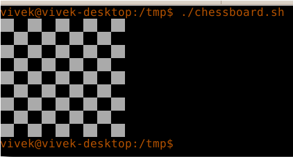

# Loop bayonoti uchun ichki o'rnatilgan

#### Nested for loops ichidagi  bildiradi. Ular bir nechta narsalar uchun server vaqtlarini takrorlashni xohlaganingizda foydalidir. Masalan, ```nestedfor.sh``` nomli shell skriptini yarating:


```
#!/bin/bash
# A shell script to print each number five times.
for (( i = 1; i <= 5; i++ ))      ### Outer for loop ###
do

    for (( j = 1 ; j <= 5; j++ )) ### Inner for loop ###
    do
          echo -n "$i "
    done

  echo "" #### print the new line ###
done
```

#### Faylni saqlang va yoping. Uni quyidagicha ishga tushiring:

```
chmod +x nestedfor.sh
./nestedfor.sh
```

#### Namuna natijalari:

```
1 1 1 1 1 
2 2 2 2 2 
3 3 3 3 3 
4 4 4 4 4 
5 5 5 5 5 
```

#### i ning har bir qiymati uchun ichki tsikl 5 marta aylanadi, j o'zgaruvchisi 1 dan 5 gacha bo'lgan qiymatlarni oladi. Ichki for tsikli j qiymati 5 dan oshganda, tashqi sikl esa i qiymati 5 dan oshganda tugaydi.


# Shaxmat taxtasiga misol

#### Shaxmat taxtasi shaxmat o'yinida qo'llaniladigan shashka turi bo'lib, 64 kvadratdan - sakkiz qator va ikkita o'zgaruvchan rangda joylashgan sakkiz ustundan iborat. Ranglar "qora" va "oq" deb nomlanadi. Ekranda shaxmat taxtasini ko'rsatish uchun chessboard.sh nomli qobiq skriptini yozamiz:

```
#!/bin/bash
for (( i = 1; i <= 8; i++ )) ### Outer for loop ###
do
   for (( j = 1 ; j <= 8; j++ )) ### Inner for loop ###
   do
        total=$(( $i + $j))   # total 
        tmp=$(( $total % 2))  # modulus
        # Find out odd and even number and change the color 
        # alternating colors using odd and even number logic  
        if [ $tmp -eq 0 ]; 
        then
            echo -e -n "\033[47m  "
        else
            echo -e -n "\033[40m  "
        fi
  done
 echo "" #### print the new line ###
done
```

#### Faylni saqlang va yoping. Uni quyidagicha ishga tushiring:

```
chmod +x chessboard.sh
./chessboard.sh
```

#### Namuna natijalari:


            


