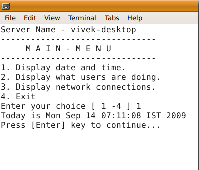

# Cheksiz while sikli

#### Sinov oʻtkazish yoki cheksiz yoki cheksiz siklni oʻrnatish uchun while sikli bilan maxsus buyruqdan foydalanishingiz mumkin. Cheksiz tsikl, siklning o'ziga xos xususiyati tufayli shart hech qachon bajarilmasa paydo bo'ladi. Bu kerakli xatti-harakat bo'lgan bir nechta holatlar mavjud. Masalan, menyuga asoslangan dastur odatda foydalanuvchi o'zining asosiy menyusidan chiqishni tanlamaguncha davom etadi ```(loop).``` Cheksiz while siklini o'rnatish uchun:


1. ```true command```  -  hech narsa qilmang, muvaffaqiyatli (har doim chiqish kodini 0 qaytaradi)
2. ```false command ``` - hech narsa qilmang, muvaffaqiyatsiz (har doim chiqish kodi 1ni qaytaradi)
3. ```: command ``` - ta'siri yo'q; buyruq hech narsa qilmaydi (har doim chiqish kodini 0 qaytaradi)

# Sintaksis

#### Cheksiz siklni o'rnatish uchun ```:``` buyrug'idan foydalaning:

```
#!/bin/bash
# Recommend syntax for setting an infinite while loop
while :
do
	echo "Do something; hit [CTRL+C] to stop!"
done
```

#### Cheksiz siklni o'rnatish uchun ```true``` buyrug'idan foydalaning:

```
#!/bin/bash
while true
do
	echo "Do something; hit [CTRL+C] to stop!"
done
```

#### Cheksiz siklni o'rnatish uchun ```false``` buyrug'idan foydalaning:


#### E'tibor bering, birinchi sintaksis tavsiya etiladi: shellning o'zi, ya'ni: shell o'rnatilgan buyrug'idir.

### Menyuda boshqariladigan dastur while siklidan foydalanadi

#### Quyidagi menyuga asoslangan dastur odatda foydalanuvchi 4-opsiyani bosib chiqishni tanlamaguncha davom etadi. ```Case``` bayonoti qiymatlarni ```$choice``` o'zgaruvchisiga moslashtirish uchun ishlatiladi va u foydalanuvchilarning tanloviga ko'ra tegishli choralarni ko'radi.```menu.sh``` deb nomlangan shell skriptini yarating:

```
#!/bin/bash
# set an infinite loop
while :
do
	clear
        # display menu
        echo "Server Name - $(hostname)"
	echo "-------------------------------"
	echo "     M A I N - M E N U"
	echo "-------------------------------"
	echo "1. Display date and time."
	echo "2. Display what users are doing."
	echo "3. Display network connections."
	echo "4. Exit"
        # get input from the user 
	read -p "Enter your choice [ 1 -4 ] " choice
        # make decision using case..in..esac 
	case $choice in
		1)
			echo "Today is $(date)"
			read -p "Press [Enter] key to continue..." readEnterKey
			;;
		2) 
			w	
			read -p "Press [Enter] key to continue..." readEnterKey
			;;
		3)
			netstat -nat
			read -p "Press [Enter] key to continue..." readEnterKey
			;;
		4)
			echo "Bye!"
			exit 0
			;;
		*)
			echo "Error: Invalid option..."	
			read -p "Press [Enter] key to continue..." readEnterKey
			;;
	esac		
				
done
```

#### Faylni saqlang va yoping. Uni quyidagicha ishga tushiring:

```
chmod +x menu.sh
./menu.sh
```

#### Namuna natijalari:

