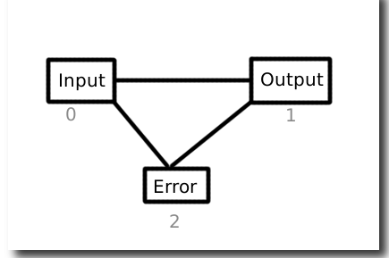

# Kirish va chiqish


#### Deyarli barcha buyruqlar chiqishni ekranga chiqarish yoki klaviaturadan kiritish uchun ishlab chiqaradi, lekin Linuxda faylga chiqishni yuborish yoki fayldan kiritilgan ma'lumotlarni o'qish mumkin. Har bir shell buyrug'i o'z kirish va chiqishlariga ega. Buyruq bajarilishidan oldin uning kirish va chiqishi qobiq tomonidan izohlangan maxsus belgi yordamida qayta yo'naltirilishi mumkin. Kirish yoki chiqishning standart yo'lini o'zgartirish qayta yo'naltirish deb ataladi.




- Linuxda hamma narsa fayl.
- Sizning ```hardware``` ham fayldir:
- 0 - ```Input``` - Keyboard (stdin)
- 1 - ```Output``` - Screen (stdout)
- 2 - ```Error``` - Screen (stderr)


#### Yuqoridagi uchta raqam standart POSIX raqamlari va fayl deskriptorlari (FD) sifatida ham tanilgan. Har bir Linux buyrug'i hech bo'lmaganda foydalanuvchilar yoki boshqa tizim dasturlari bilan suhbatlashish uchun yuqoridagi oqimlarni ochadi.


|<div style="background:red">Syntax</div>  | Description | Test Text     |
| :---        |    :----:   |          ---: |
| Header      | Title       | Here's this   |
| Paragraph   | Text        | And more      |
