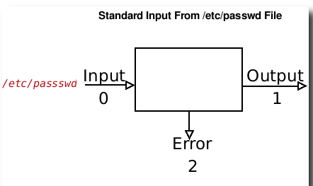

# Standart kirish

- Standart kiritish standart kiritish usuli bo'lib, u kiritilgan ma'lumotlarni o'qish uchun barcha buyruqlar tomonidan qo'llaniladi.
- U nol raqami (0) bilan belgilanadi.
- ```Stdin``` sifatida ham tanilgan.
- Standart standart kiritish klaviaturadir.
- ```<``` - kirishni qayta yo'naltirish belgisi va sintaksisi:


```
 command < filename
```

- Masalan, ekranda /etc/passwd ni ko'rsatish uchun cat buyrug'ini quyidagicha bajarishingiz mumkin:


```
cat < /etc/passwd
```



- /etc/resolv.conf faylini saralash uchun quyidagilarni kiriting:

```
sort < /etc/resolv.conf
```