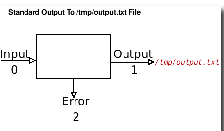

# Standart chiqish

- Standart chiqish uning chiqishini yozish (ko'rsatish) uchun buyruq tomonidan ishlatiladi.
- Standart - bu ekran.
- U bitta raqam (1) bilan belgilanadi.
- ```Stdout``` sifatida ham tanilgan.
- Standart standart chiqish ekrandir.
- ```>``` - chiqishni qayta yo'naltirish belgisi va sintaksisi:


```
command > output.file.name
```

- Masalan, ls buyrug'i sukut bo'yicha o'z natijasini ekranga yozadi:

```
ls
```

- Lekin, siz chiqishni output.txt deb nomlangan faylga saqlashingiz mumkin, kiriting:

```
ls > /tmp/output.txt
```




- Faylni ko'rish uchun quyidagilarni kiriting:

```
cat /tmp/output.txt
```

- E'tibor bering,``` /tmp/output.txt``` fayli mavjud bo'lmasa, yaratiladi. Va agar fayl ```/tmp/output.txt``` fayli chiqsa, ustiga yozilsa.
- Bundan tashqari, skript chiqishini faylga saqlashingiz mumkin:


```
./your.script.name.sh > myoutput
cat myoutput
```
