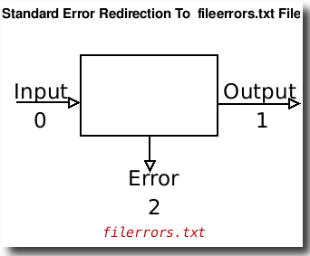

# Standart xato

- Standart xato - bu barcha tizim xato xabarlarini yozish uchun ishlatiladigan standart xato chiqarish qurilmasi.
- U ikkita raqam (2) bilan belgilanadi.
- Shuningdek, ```stderr``` sifatida ham tanilgan.
- Odatiy standart xato qurilmasi ekran yoki monitordir.
- 2> - kirishni qayta yo'naltirish belgisi va sintaksisi:

```
 command 2> errors.txt
```

- Misol uchun, ```fileerrors.txt``` deb nomlangan faylga ```find``` buyrug'i xatolarini yuboring, shunda xatolarni keyinroq ko'rib chiqishingiz mumkin, kiriting:


```
find / -iname "*.conf" 2>fileerrors.txt
cat fileerrors.txt
```

