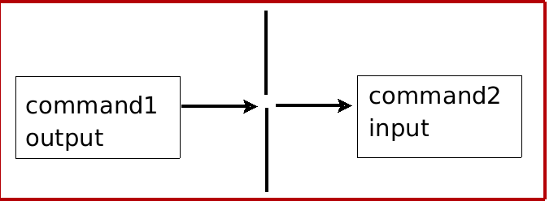

# Pipes

#### ```Shell Pipesi``` - bu bitta dasturning chiqishini boshqa dasturning kirishiga vaqtinchalik faylsiz ulash usuli.


# Sintaksis

```
command1 | command2
command1 | command2 | commandN
command1 arg1 | command2 arg1 arg2
get_data_command | verify_data_command | process_data_command | format_data_command > output.data.file
get_data_command < input.data.file | verify_data_command | process_data_command | format_data_command > output.data.file
```

- Bir vaqtning o'zida ikkita yoki undan ortiq buyruqlarni ulashingiz mumkin.
- Ikki dasturni birlashtiruvchi ma'lumotlar yo'liga ```pipes``` deyiladi.
- Vertikal chiziq ```(|)``` ````pipes```` belgisidir.
- ```Shell pipesi``` Unix dasturlarini murakkab vazifani bajarish uchun yanada chuqurroq zanjirlash falsafasini qo'llab-quvvatlaydi.
- ```Pipeslarda``` qayta yo'naltirishga ham ruxsat beriladi.
- Ma'lumotlar yo'li faqat bitta yo'nalishda ishlaydi:


