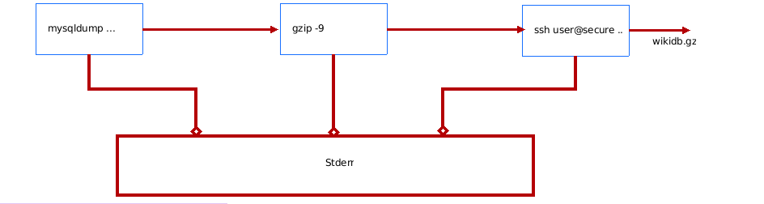

# Nima uchun pipes ishlatish kerak


#### Ushbu misolda ```mysqldump``` ma'lumotlar bazasini zahiralash dasturi ```wiki``` deb nomlangan ma'lumotlar bazasini zaxiralash uchun ishlatiladi:


```
mysqldump -u root -p'passWord' wiki > /tmp/wikidb.backup
gzip -9 /tmp/wikidb.backup
scp /tmp/wikidb.backup user@secure.backupserver.com:~/mysql
```
- ```Mysqldump``` buyrug'i ```wiki``` deb nomlangan ma'lumotlar bazasini ```/tmp/wikidb.backup``` fayliga zaxiralash uchun ishlatiladi.


- ```Gzip``` buyrug'i disk maydonini tejash uchun katta ma'lumotlar bazasi faylini siqish uchun ishlatiladi.

- ```Scp``` buyrug'i faylni ```safe.backupserver.com``` deb nomlangan saytdan tashqari zaxira serveriga ko'chirish uchun ishlatiladi.


- Barcha uchta buyruqlar birin-ketin ishlaydi.
- ```/tmp``` da mahalliy diskda vaqtinchalik fayl yaratiladi.


- Biroq, ```pipes``` yordamida siz ```/tmp/wikidb.backup ```faylini yaratmasdan, ```mysqldump``` buyrug'ining standart chiqishini ```gzip``` buyrug'ining standart kiritishiga qo'shishingiz mumkin:


```
mysqldump -u root -p'passWord' wiki | gzip -9 > /tmp/wikidb.backup
scp /tmp/wikidb.backup user@secure.backupserver.com:~/mysql
```

- Siz birgalikda vaqtinchalik fayl yaratishdan qochishingiz va bir vaqtning o'zida buyruqlarni bajarishingiz mumkin:


```
mysqldump -u root -p'passWord' wiki | gzip -9 |  ssh user@secure.backupserver.com "cat > /home/user/mysql/wikidb.gz"
```

- Yuqoridagi sintaksis ixcham va ishlatish uchun qulay.
- Siz ```pipes``` yordamida masofaviy ```MySQL``` zaxira nusxasini yaratish uchun murakkab vazifani bajarish uchun uchta dasturni birlashtirdingiz.
- Ma'lumotlarni filtrlash ```pipes``` foydalanishning yana bir yaxshi sababidir.

- E'tibor bering, ```pipes``` standart xatosi bir-biriga aralashtiriladi:

