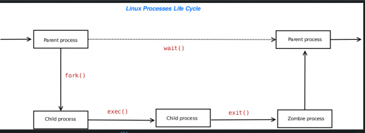

# Jarayon nima?

#### Linux - bu ko'p foydalanuvchi (bir nechta foydalanuvchilar Linuxga kirishlari va uning resurslarini baham ko'rishlari mumkin) va ko'p vazifali operatsion tizim. Bu siz bir vaqtning o'zida bir nechta buyruqlarni bajarishingiz va bir nechta vazifalarni bajarishingiz mumkinligini anglatadi.


# Jarayon haqida batafsil

#### Masalan, siz ```mp3``` tinglayotganda ``c`` dasturini yozishingiz yoki fonda ```P2P``` yordamida fayllarni yuklab olishingiz mumkin.

- Jarayon - bu muayyan ishni bajarish uchun dastur (yoki foydalanuvchi tomonidan kiritilgan buyruq).
- Linuxda jarayonni boshlaganingizda, unga ```PID``` yoki jarayon identifikatori deb ataladigan noyob raqam beriladi.
- PIDlar 0 dan 65535 gacha boshlanadi.
- PID 1 har doim ishga tushirish jarayoniga tayinlanadi, bu yuklash vaqtida boshlangan birinchi jarayondir. Init har doim PID 1 ekanligini tekshirish uchun quyidagi buyruqni kiriting:

```
ps -C init -o pid=,cmd

```

#### Namuna natijalari:

```
    CMD
    1 /sbin/init
```

# Parent and Child Processes

- ```Parent``` jarayoni - bu bir yoki bir nechta asosiy jarayonlarni yaratgan Linux jarayoni.
- Jarayon ```child``` buzishi mumkin, ya'ni ```child``` jarayonini yaratishi mumkin.
- Misol uchun, agar foydalanuvchi `ls` buyrug'ini shell so'rovida yozsa.
- Shell ```ls``` buyrug'ini bajaradi.
- Linux yadrosi shell xotira sahifalarini takrorlaydi va keyin ```ls``` buyrug'ini bajaradi.
- UNIX da har bir jarayon ``fork`` va ```exec``` usuli yordamida yaratiladi. Biroq, bu model tizim resurslarining behuda sarflanishiga olib keladi.
- Linuxda ```fork``` usuli nusxa ko'chirish-yozish sahifalari yordamida amalga oshiriladi, shuning uchun uning yagona jazosi ```Parent``` sahifalari jadvallarini ko'paytirish va ```child``` uchun noyob vazifa tuzilishini yaratish uchun zarur bo'lgan vaqt va xotiradir.
- Yozuvga nusxa ko'chirish modeli yangi jarayonlarni yaratishda tuzilmalarning keraksiz nusxalarini yaratishdan qochadi.
- Misol uchun, foydalanuvchi shell so'rovida ```ls``` buyrug'ini kiritadi.
- Linux yadrosi vilkalar hosil qiladi va bashning pastki jarayoni yoki ```child``` jarayonini yaratadi.
- Misol uchun, foydalanuvchi qobiq so'rovida ```ls``` buyrug'ini kiritadi.
- Bu misolda bash ```Parent```, ```ls``` buyrug'i esa ```child```. Boshqacha qilib aytganda, ```ls``` buyrug'i bash shelli bilan bir xil xotira sahifalariga yo'naltiriladi.





# Jarayon holatlari

#### Har bir Linux jarayoni yaratilish, bajarish, tugatish va olib tashlash kabi o'z hayot aylanishiga ega. Har bir jarayonning o'z holati mavjud bo'lib, u hozirda jarayonda nima sodir bo'layotganini ko'rsatadi. Quyidagilardan biri bo'lishi mumkin bo'lgan jarayonning holati:

1. ```D (uzluksiz sleep)``` - Jarayon sleep holatida va I/U kabi hodisa ro'y bermaguncha uni qaytarib bo'lmaydi
2. ```R (running)``` - Jarayon ishlamoqda yoki bajarilmoqda.
3. ```S (sleeping)```  - Jarayon ishlamayapti va hodisa yoki signalni kutmoqda.
4. ```T (kuzatilgan yoki to'xtatilgan)``` - Jarayon ```SIGINT``` yoki ```SIGSTOP``` kabi signallar bilan to'xtatiladi.
5. Z ```(zombie or defunct)``` - <Funct> deb belgilangan jarayonlar o'lik jarayonlar ("zombi" deb ataladi) bo'lib, ularning ota-onalari ularni to'g'ri yo'q qilmaganligi sababli qoladi. Agar asosiy jarayon chiqsa, bu jarayonlar init tomonidan yo'q qilinadi.


# Jarayon holatlarini qanday ko'rishim mumkin

#### Jarayonning holatini ko'rish uchun quyidagilarni kiriting:

```
 ps -C processName -o pid=,cmd,stat
```

#### Masalan, ```lighttpd```, ```php-cgi``` va ```firefox-bin``` jarayonlarining holatini ko'rsatish uchun quyidagilarni kiriting:

```
ps -C firefox-bin  -o pid=,cmd,stat
ps -C lighttpd -o pid=,cmd,stat
ps -C php-cgi -o pid=,cmd,stat
```

#### Namuna natijalari:

```
      CMD                         STAT
 7633 /opt/firefox/firefox-bin    Sl

      CMD                         STAT
32082 /usr/sbin/lighttpd -f /etc/ S
32326 /usr/sbin/lighttpd -f /etc/ S

      CMD                         STAT
 1644 /usr/bin/php-cgi            S
31331 /usr/bin/php-cgi            S
31332 /usr/bin/php-cgi            S
31538 /usr/bin/php-cgi            S
```