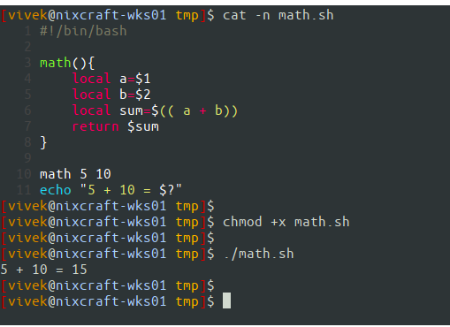

# Argumentlarni funktsiyaga o'tkazish


#### Keling, parametrlarni Bash funktsiyasiga qanday o'tkazishni ko'rib chiqaylik.


- shell funktsiyasi - bu to'liq tartib sifatida ishlaydigan bir yoki bir nechta buyruqlar / bayonotlar to'plamidan boshqa narsa emas.
- Har bir funktsiya o'ziga xos nomga ega bo'lishi kerak.
- Shell funktsiyalari o'zlarining buyruq qatori argumentlari yoki parametrlariga ega.
- Funksiyaga uzatilgan argumentga kirish uchun ```$1, $2,..$n``` qobiq oʻzgaruvchisidan foydalaning.


# Parametrlarni Bash funktsiyasiga o'tkazish

- shell skriptida foydalanuvchi tomonidan belgilangan funktsiyalarni yaratish uchun sintaksis quyidagicha:

```
function_name(){
   command_block_here
}
## OR ##
function function_name_here(){
   command_line_block
}
## passing parameters to a Bash function ##
my_function_name(){
  arg1=$1
  arg2=$2
  command on $arg1
}
```

### Funktsiyani chaqirish

- Funktsiyani chaqirish uchun quyidagi sintaksisdan foydalaning:


```
 my_function_name foo bar
```

1. ```my_function_name``` - Funktsiyangiz nomi.
2. ```foo``` - 1-argument funktsiyaga o'tkazildi (pozitsion parametr №1).
3. ```bar``` - 2-argument funktsiyaga o'tkazildi.


### Misollar

#### ```fresh.sh``` nomli funksiya yarating:

```
#!/bin/bash
 
# write a function
fresh(){
   # t stores $1 argument passed to fresh()
   t=$1
   echo "fresh(): \$0 is $0"
   echo "fresh(): \$1 is $1"
   echo "fresh(): \$t is $t"
   echo "fresh(): total args passed to me $#"
   echo "fresh(): all args (\$@) passed to me -\"$@\""
   echo "fresh(): all args (\$*) passed to me -\"$*\""
}
 
# invoke the function with "Tomato" argument
echo "**** calling fresh() 1st time ****"
fresh Tomato
 
# invoke the function with total 3 arguments
echo "**** calling fresh() 2nd time ****"
fresh Tomato Onion Paneer
```

#### Faylni saqlang va yoping. Uni quyidagicha ishga tushiring:

```
chmod +x fresh.sh
./fresh.sh
```

#### Namuna natijalari:

```
**** calling fresh() 1st time ****
fresh(): $0 is ./fresh.sh
fresh(): $1 is Tomato
fresh(): $t is Tomato
fresh(): total args passed to me 1
fresh(): all args ($@) passed to me -"Tomato"
fresh(): all args ($*) passed to me -"Tomato"
**** calling fresh() 2nd time ****
fresh(): $0 is ./fresh.sh
fresh(): $1 is Tomato
fresh(): $t is Tomato
fresh(): total args passed to me 3
fresh(): all args ($@) passed to me -"Tomato Onion Paneer"
fresh(): all args ($*) passed to me -"Tomato Onion Paneer"
```

#### Keling, yana bir misolni sinab ko'raylik.Berilgan nom fayl yoki katalog ```(cmdargs.sh) ```ekanligini aniqlash uchun yangi shell skriptini yarating:


```
#!/bin/bash
# Name - cmdargs.sh
# Purpose - Passing positional parameters to user defined function 
# -----------------------------------------------------------------
file="$1"

# User-defined function
is_file_dir(){
        # $f is local variable
	local f="$1"
        # file attributes comparisons using test i.e. [ ... ]
	[ -f "$f" ] && { echo "$f is a regular file."; exit 0; }
	[ -d "$f" ] && { echo "$f is a directory."; exit 0; }
	[ -L "$f" ] && { echo "$f is a symbolic link."; exit 0; }
	[ -x "$f" ] && { echo "$f is an executeble file."; exit 0; }
}

# make sure filename supplied as command line arg else die
[ $# -eq 0 ] && { echo "Usage: $0 filename"; exit 1; }

# invoke the is_file_dir and pass $file as arg
is_file_dir "$file"
```

#### Uni quyidagicha ishga tushiring:

```
./cmdargs.sh /etc/resolv.conf
./cmdargs.sh /bin/date
./cmdargs.sh $HOME
./cmdargs.sh /sbin
```

#### Namuna natijalari:

```
/etc/resolv.conf is a regular file.
/bin/date is a regular file.
/home/vivek is a directory.
/sbin is a directory.
```
### Funktsiya shellining o'zgaruvchilari

- Barcha funktsiya parametrlari yoki argumentlariga ```$1, $2, $3,..., $N ```orqali kirish mumkin.
- ```$0``` har doim shell skripti nomiga ishora qiladi.
- ```$*``` yoki ```$@``` funksiyaga uzatilgan barcha parametrlar yoki argumentlarni saqlaydi.
- ```$#``` funksiyaga uzatilgan pozitsion parametrlar sonini saqlaydi.


### Funktsiya nomini qanday ko'rsataman?

#### ```$0``` har doim shell skripti nomiga ishora qiladi. Biroq, siz ```FUNCNAME``` deb nomlangan massiv o'zgaruvchisidan foydalanishingiz mumkin, u hozirda ijro chaqiruvlari stekidagi barcha shell funktsiyalari nomlarini o'z ichiga oladi. ```0``` indeksli element hozirda bajarilayotgan shell funksiyasining nomidir. Bu o'zgaruvchi faqat shell funksiyasi bajarilayotganda mavjud bo'ladi.


### ```FUNCNAME``` amalda

#### ```funcback.sh``` deb nomlangan shell skriptini yarating:

```
#!/bin/bash
#  funcback.sh : Use $FUNCNAME
backup(){
	local d="$1"
	[[ -z $d ]] && { echo "${FUNCNAME}(): directory name not specified"; exit 1; }
	echo "Starting backup..."
}

backup $1
```

#### Faylni saqlang va yoping. Uni quyidagicha ishga tushiring:

```
chmod +x funcback.sh
funcback.sh /home
funcback.sh
```

#### Namuna natijalari:

```
backup(): directory name not specified
```

# Return qiymatlar


#### Return buyrug'i yordamida funktsiyadan qiymatni bashga Return mumkin. Return bayonoti funksiyani tugatadi. Sintaksis quyidagicha:

```
return
return [value]
```

#### Skriptni [value] tomonidan belgilangan Return qiymati bilan chiqishga majburlash mumkin. Agar [qiymat] o'tkazib yuborilsa, Return holati funksiya yoki skript ichida bajarilgan oxirgi buyruqning holatidir.


### Misollar


#### ```Math.sh``` nomli yangi fayl yarating:

```
#!/bin/bash
#!/bin/bash
# Name - math.sh
# Purpose - Demo return value 
# ------------------------------------

## user define function
math(){
	local a=$1
	local b=$2
	local sum=$(( a + b))
	return $sum
}

## call the math function with 5 and 10 as  arguments 
math 5 10

## display back result (returned value) using $?
echo "5 + 10 = $?"
```

#### Uni quyidagicha ishga tushiring:

```
chmod +x math.sh
./math.sh
```

